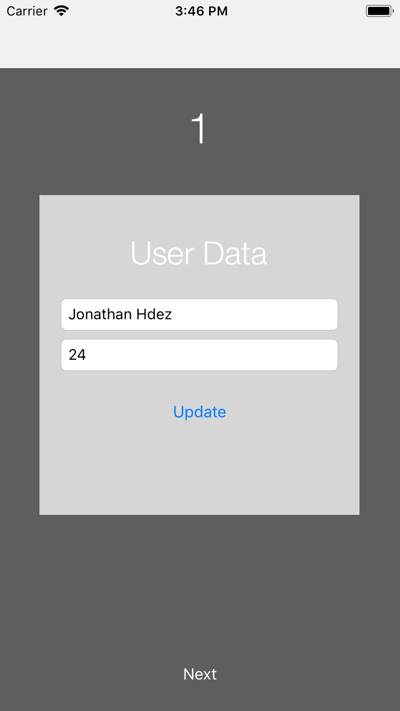
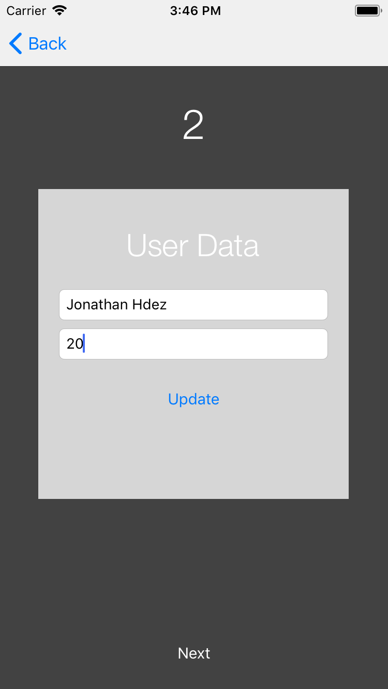
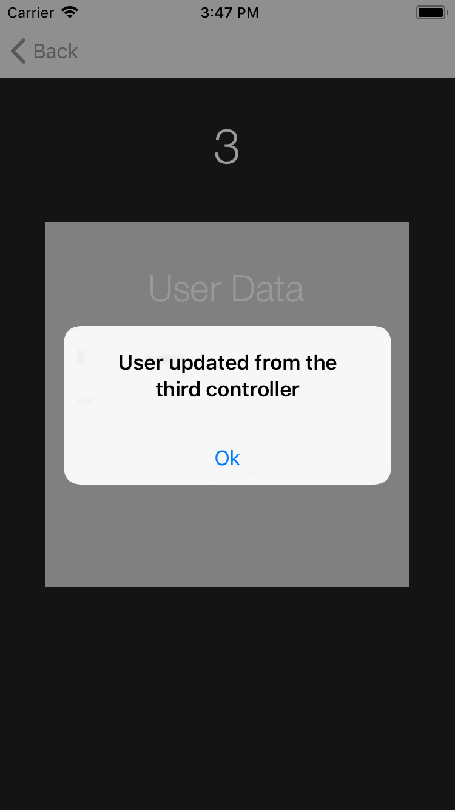

# Singleton
>  The purpose of this project is to show the basic functions of the following topics :

- Custom views using XIB files
- Share static data using Singleton Pattern

## Requirements

- iOS 8.0+
- Xcode 9
- Swift 4
- Cocoapods 1.3.+

## Meta

Jonathan Guillermo – hernandezmarquina@gmail.com

Distributed under the MIT license.

[Github - hernandezmarquina](https://github.com/hernandezmarquina)
